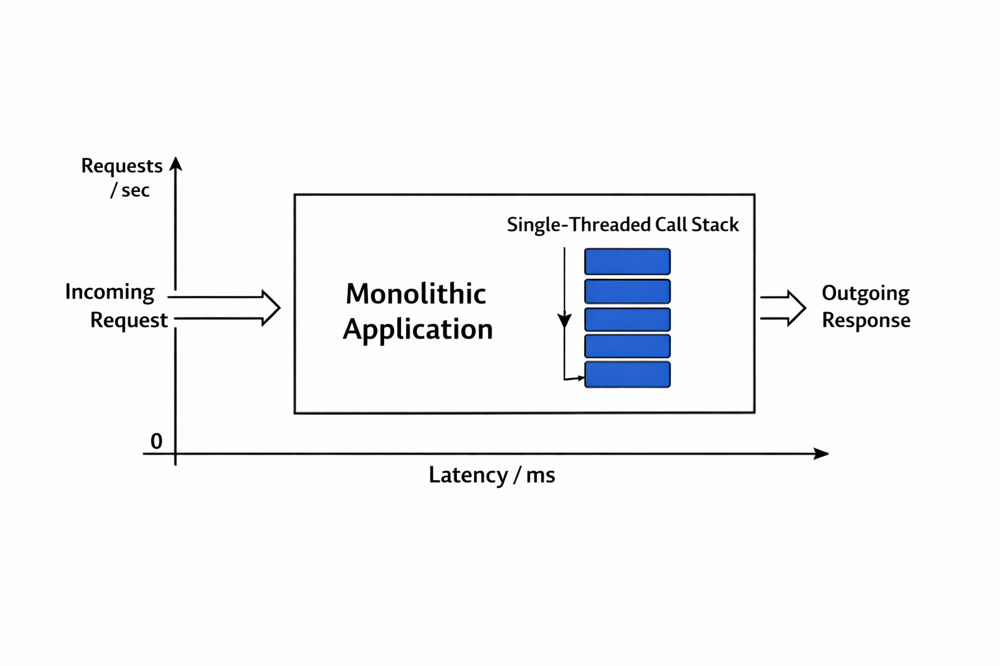
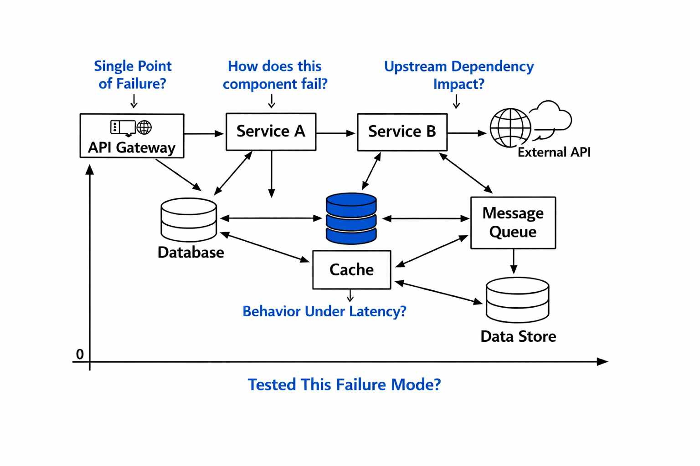

# Architecting for Failure: A Production-Driven Guide to System Design from First Principles

---

### Phase 1: The Foundation - Building Intuitive Mental Models

This phase establishes the foundational mental models for thinking about systems, moving beyond idealized "happy paths" to build an initial intuition for how components interact under stress. It introduces core definitions and metrics that form the language of reliability engineering, providing the essential vocabulary needed for subsequent phases. The objective is to create a baseline understanding where a system is perceived not just as its functional components, but as a dynamic entity subject to load, latency, and failure. This begins with the most fundamental distinction in concurrent computing: concurrency versus parallelism . Concurrency describes the structure of a program designed to handle multiple tasks at once, while parallelism describes the simultaneous execution of those tasks, typically on multiple CPU cores . Understanding this difference is crucial because modern CPUs execute instructions out-of-order (OOO), meaning a single core can overlap operations, making the physical execution of code non-linear . This underlying hardware behavior has profound implications for memory access patterns and performance bottlenecks, which will be explored in greater detail in the Physics phase. For now, it establishes that our mental models must account for this inherent complexity.

The next step is to introduce the core metrics that translate business objectives into quantifiable engineering goals. Site Reliability Engineering (SRE) provides a powerful framework for this through its concepts of Service Level Indicators (SLIs), Service Level Objectives (SLOs), and Service Level Agreements (SLAs) . An SLI is a specific metric that measures the performance of a service, such as request latency or error rate. An SLO is a target value for that SLI, representing the desired level of performance . For example, an SLO might state that "99% of API requests must succeed within 200ms." The SLA is the contractual agreement that defines the consequences if the SLO is not met, often tied to financial penalties or credits . These concepts are central to quantifying acceptable risk through the use of error budgets . An error budget represents the amount of unreliability a service can tolerate before breaching its SLA; when it is spent, no more failures are allowed until the budget resets . This framework forces a shift from simply "keeping the system running" to actively managing the trade-off between feature development (which consumes error budget) and reliability work (which conserves it). This mindset is a cornerstone of modern production engineering culture .

To monitor these metrics effectively, engineers rely on what Google calls the "Golden Signals": Latency, Traffic, Errors, and Saturation . These four signals provide a holistic view of a system's health and directly correlate to user experience and operational strain. Latency measures the time taken to fulfill a request, directly impacting user perception of responsiveness . Traffic represents the demand placed on the system, measured in requests per second (RPS) . Errors track the rate of failed requests, indicating problems with correctness . Saturation measures the utilization of a resource, such as CPU or network bandwidth, signaling how close the system is to its capacity limit . By monitoring these signals, teams can move beyond simple uptime alerts to understand the root cause of performance degradation. For instance, high latency could be caused by either increased traffic or saturation of a downstream dependency. Connecting these observability signals to SLOs allows for automated alerting and decision-making based on real user impact . The AWS Well-Architected Framework further formalizes this approach by organizing best practices around six pillars: Operational Excellence, Security, Reliability, Performance Efficiency, Cost Optimization, and Sustainability . While this guide focuses primarily on Reliability and Performance Efficiency, the others provide a broader context for responsible system design .

> ⚠️ **Anti-Pattern: Ignoring Concurrency and Latency Trade-offs**  
> [Description: Designing a system under the assumption of a linear, synchronous "happy path" without considering the impact of concurrent requests and variable latency. This leads to poor capacity planning, unexpected performance degradation under load, and a false sense of system stability.]
>
> 🔑 **Key Takeaway:** A system is not merely its happy-path functionality; it is a collection of components interacting under stress. Foundational concepts like concurrency, SLOs, error budgets, and the Golden Signals provide the necessary vocabulary and tools to reason about system behavior beyond ideal conditions.

---

### Phase 2: The Reality - Mechanics of Failure and Resilience Patterns

This phase transitions from theoretical foundations to the mechanics of how systems break in the real world. The primary teaching tool is a series of detailed post-mortems from high-profile production incidents. These are not merely cautionary tales but serve as concrete evidence for breaking points and anti-patterns, demonstrating how seemingly minor changes can trigger catastrophic failures. Each incident is immediately followed by the corresponding standard patterns and trade-offs designed to mitigate such risks. This creates a direct link between failure and resilience, illustrating that building robust systems is an active process of identifying and hardening against potential failure modes. The Coinbase outage of May 2026 provides a stark lesson in the trade-off between performance and resilience . To achieve ultra-low latency for high-frequency trading, their exchange matching engine operated as a Raft-based cluster within a single AWS Cluster Placement Group, intentionally collocating all nodes to minimize network latency . This tight coupling created a single point of failure (SPOF) at the Availability Zone level. When a localized cooling failure forced a thermal shutdown in the US-East-1 region, three of the five cluster nodes were taken offline, causing the entire matching engine to lose quorum and cease processing trades . The architecture lacked any automated cross-zone recovery mechanism, forcing engineers into a manual, emergency reconstruction of the cluster to restore quorum and resume service . This event highlights a critical anti-pattern where optimization for a single metric (latency) inadvertently created a systemic fragility.

> 💥 **Post-Mortem: Coinbase Matching Engine Outage (May 2026)**  
> A localized cooling failure in an AWS data center caused a thermal shutdown, taking down EC2 instances and EBS volumes in a single Availability Zone. Because the Raft-based matching engine was tightly coupled to this single zone to minimize latency, losing three of its five nodes resulted in a loss of quorum, halting all trading activity. Recovery required manual intervention to reconstruct the cluster and restore quorum. The incident demonstrates how optimizing for low latency can create unacceptable resilience risks .

The AWS DynamoDB outage of October 2025 reveals a different class of failure: a latent race condition within a complex, shared internal subsystem . The root cause was not a bug in a customer-facing application but in DynamoDB's own DNS management system, which maintains hundreds of thousands of DNS records for regional endpoints . This system had two components: the 'DNS Planner' that created new plans and the 'DNS Enactor' that applied them. A race condition occurred when a delayed Enactor applied an old plan while a newer plan was simultaneously being enacted, after which a cleanup process deleted the now-orphaned older plan. This left the regional endpoint with no valid IP addresses, causing widespread packet loss and connection timeouts across AWS services . The failure cascaded, affecting dependent systems like EC2's instance launch mechanisms for over 11 hours after the DNS issue was resolved, demonstrating that sophisticated architectures can hide critical single points of failure in shared infrastructure . This incident underscores the importance of treating dependencies on shared platforms with extreme caution, as their failure modes become your failure modes.

> 💥 **Post-Mortem: Amazon Web Services (AWS) US-EAST-1 Region Outage (October 2025)**  
> A latent race condition in DynamoDB's internal DNS management system caused regional endpoints to lose their IP address mappings. This led to massive connection timeouts and HTTP 503 errors for services across the region. The outage lasted over 15 hours, with full recovery hindered by cascading effects on dependent systems like EC2, which continued to fail due to the lingering DNS state issues .

A third critical failure mode is the unbounded growth of data structures, exemplified by the Cloudflare Bot Management outage of November 2025 . The incident was triggered by a routine change to ClickHouse database permissions that altered a query's output. Specifically, a query that generated a feature file for machine learning models began returning duplicate rows, doubling the size of the output file . This oversized file was then processed by the Bot Management module, which contained a hardcoded memory allocation limit of 200 features. When the feature file exceeded this limit, the Rust application panicked, causing the service to crash and return widespread 5xx errors for all dependent services, including the Core CDN and Workers KV . The outage, lasting from 11:28 UTC to 17:06 UTC, was resolved only after deploying a known-good version of the feature file globally . This case illustrates the danger of brittle assumptions about data size and the necessity of validating inputs and implementing graceful degradation.

> 💥 **Post-Mortem: Cloudflare Bot Management Outage (November 2025)**  
> A change in ClickHouse database permissions caused a feature file generation query to return double the expected number of rows. The resulting oversized file exceeded a hardcoded memory limit in the Bot Management module, triggering a panic and a cascade of 5xx errors across multiple Cloudflare services. The incident highlights the risk of static limits and unvalidated assumptions about data input sizes .

These realities give rise to several key resilience patterns. The primary trade-off identified is between performance (e.g., minimizing latency) and resilience (e.g., ensuring availability). The solution is not to abandon one for the other but to architect for graceful degradation. For Coinbase, this meant implementing automated cross-zone recovery for its matching engine to survive single-AZ failures . For the Cloudflare incident, it means preventing error reports from overwhelming resources and enabling global kill switches for problematic features . A more advanced pattern, pioneered by Netflix, is prioritized load shedding . Instead of letting a service exhaust all its resources during an overload, it proactively sheds less-critical requests to protect itself and maintain functionality for core operations . This moves the failure mode from a complete system collapse to a controlled degradation of service, preserving the user experience as much as possible .

> ⚠️ **Anti-Pattern: Centralized Control Plane Overload**  
> Relying on a single, centralized component (like an API Gateway) to make global decisions (like load shedding) creates a scaling and resilience bottleneck. As traffic grows, this component becomes a potential single point of failure for the entire platform, limiting the system's ability to scale and respond to localized failures.

> ⚠️ **Anti-Pattern: Unvalidated Data Assumptions**  
> Hardcoding limits or making assumptions about the size or format of external data inputs (e.g., database query results, API responses) creates a brittle system. A change in the data source can lead to unexpected panics, memory exhaustion, or incorrect behavior, as seen in the Cloudflare Bot Management outage .

> 🔑 **Key Takeaway:** Real-world systems fail not in idealized ways but through the interaction of latent defects, operational changes, and systemic weaknesses. The path to building resilient systems lies in proactively identifying and mitigating these failure modes through patterns like redundancy, graceful degradation, and controlled failure.

---

### Phase 3: The Scale - Distributed Systems and Cascading Consequences

At scale, the principles of distributed computing transform from academic abstractions into life-and-death concerns for system reliability. Individual component failures become inevitable, not exceptional. Therefore, the focus shifts from preventing every failure to designing systems that can withstand, contain, and recover from them gracefully. This phase explores the systemic behaviors that emerge when multiple nodes and networks interact, using integrated post-mortems to illustrate how local failures can propagate into global catastrophes. It examines anti-patterns related to centralized control and inadequate dependency isolation, and introduces scalable patterns like decentralized decision-making and proactive failure testing. The AWS DynamoDB outage serves as a canonical example of a cascading failure, where an issue in one subsystem rippled outward, amplifying the impact exponentially . The initial problem—a DNS record inconsistency—caused packet loss at AWS edge nodes (network layer), which then manifested as connection timeouts at the application layer and finally as HTTP 503 errors from backend systems unable to process requests . The recovery process unfolded in distinct phases, starting with fixing the root cause, followed by addressing the cascading effects in dependent systems, clearing accumulated backlogs, and finally allowing application-level recovery to complete . This sequence highlights the immense complexity introduced by cascading failures; the initial problem may be fixed long before the system returns to normal operation .

The Cloudflare outages of late 2025 provide another powerful illustration of failure at scale, particularly the role of dependencies . At one point, Cloudflare handled approximately 20% of all web traffic, earning it the reputation of being a foundational piece of internet infrastructure . Its outages took a significant portion of the internet offline, affecting 28% of global HTTP traffic . This reality forces a fundamental architectural question: "If your infrastructure depends on a vendor's uptime, their failure is not a news story. It is your root risk" . The February 20, 2026, outage, which lasted over 6 hours, was triggered not by a DDoS attack or a major software bug, but by a single buggy API cleanup task that withdrew BGP prefixes, making Cloudflare's services globally unreachable . Similarly, the January 22, 2026, route leak incident was caused by an automated policy configuration error that leaked routing information, again leading to a partial outage . These events underscore the critical need for dependency mapping and the implementation of multi-cloud or multi-CDN strategies to avoid being held hostage by a single provider's failure modes .

> 💥 **Post-Mortem: Cloudflare Global Outage (February 20, 2026)**  
> A routine, buggy API cleanup task at Cloudflare withdrew a large number of customer-owned IP prefixes from the Border Gateway Protocol (BGP). This misconfiguration made Cloudflare's services globally unreachable for many customers, causing a 6-hour outage. The incident demonstrates that a small operational script can have massive, unintended consequences at internet scale .

In response to these lessons, Cloudflare has developed its own set of resilience patterns. One key initiative is "Fail Small," which involves training smarter monkeys by automatically creating and prioritizing latency-causing failure experiments . This practice of automated failure testing, or chaos engineering, is a proactive approach to finding weaknesses before they are exploited by real-world events . By intentionally injecting failures, teams can validate their resilience controls, improve their detection and triage processes, and build a stronger, safer network . This philosophy stands in contrast to reactive post-mortems alone; it aims to turn the act of failure into a learning opportunity .

Netflix offers another profound lesson in scalable resilience through the evolution of its load shedding strategy . Initially, Netflix implemented prioritized load shedding at the centralized API Gateway level. However, as the platform scaled, this centralized approach became a bottleneck and a single point of failure for the entire system . A failure in the gateway's load-shedding logic could bring down the whole service. In response, Netflix evolved its system to push the prioritization logic down to the individual service level . This decentralization allows each service to independently decide which requests to prioritize and which to shed, protecting its own resources without relying on a central arbiter . If one service becomes overloaded, it can shed less-critical requests to ensure its core functionality remains available, containing the failure and preventing a system-wide collapse. This pattern, described in detail in the Netflix Tech Blog, is a prime example of a scalable, resilient architecture .

> ⚠️ **Anti-Pattern: Inadequate Dependency Isolation**  
> Failing to properly isolate changes or failures within one part of a complex system from impacting others. The Cloudflare DNS record format change that cascaded into global router misconfigurations is a perfect example of porous system boundaries .

> ⚠️ **Anti-Pattern: Reactive Incident Response Without Proactive Testing**  
> Relying solely on post-mortems to learn from failures after they happen. While valuable, this approach is inherently reactive. It ignores the opportunity to systematically test and strengthen resilience before a real incident occurs. Chaos engineering provides a proactive alternative .

> 🔑 **Key Takeaway:** At scale, resilience is not a feature but a property that emerges from a combination of decentralized control, rigorous testing, and a deep understanding of systemic dependencies. The goal is to design systems that can fail gracefully, contain damage, and recover automatically, transforming inevitable failures into manageable, localized incidents.

---

### Phase 4: The Physics - Grounding in Hardware Limits and Mathematical Theory

This phase grounds all preceding abstractions in the immutable laws of physics and mathematics. It answers the "why" behind the patterns observed in real-world systems, moving from descriptive anecdotes to prescriptive principles. The analysis begins by declaring the domain-specific hardware constraints that dictate the absolute limits of performance, before introducing the mathematical theories that explain system behavior under load. Every assertion in this phase is rigorously tagged with an epistemic evidence level to indicate the strength of the supporting evidence. The first order of business is to identify the fundamental hardware limits that constrain all software. CPU cache performance is a critical factor in application speed. Access latency varies dramatically depending on the cache level: a load from the L1 data cache takes approximately 4 cycles, while an L2 cache miss incurs a penalty of around 6 cycles, and a miss to the L3 cache or main memory can take 30-40 cycles or more . This is a `[PROVEN PRACTICE]` that dictates the importance of writing cache-friendly code and understanding memory access patterns. On the storage front, I/O performance is a key bottleneck. Modern hardware provides quantitative anchors for capacity planning; for example, recent updates to Amazon EBS gp3 volumes allow them to scale up to 80,000 Input/Output Operations Per Second (IOPS) . This figure is a `[CONSULTED STANDARD]` derived from official product documentation and represents a key parameter for designing high-throughput storage systems. Finally, network performance is governed by the speed of light and the distance data must travel. Round-Trip Time (RTT) is a fundamental constraint that influences protocol choice and user experience. For instance, video streaming protocols are selected based on acceptable latency thresholds: WebRTC SFU requires sub-500ms RTT, LL-HLS needs 2-5s, and standard HLS/DASH can tolerate 10-30s . This is a `[CONSULTED STANDARD]` that directly links physical network physics to application-level design decisions.

With these physical constraints established, we can now apply mathematical theory to understand system behavior. The most important principle in this regard is Little's Law, a `[THEOREM]` from queueing theory that connects three fundamental performance metrics: $L = \lambda W$. Here, $L$ is the average number of requests in the system (concurrency), $\lambda$ (lambda) is the average arrival rate (throughput), and $W$ is the average time a request spends in the system (latency) . The power of this law is its generality; it holds true for any stable, ergodic system, regardless of traffic patterns . This theorem provides the quantitative foundation for understanding why latency is so dangerous. Latency acts as a multiplier on concurrency. A simple application of the law shows that an API handling 500 requests per second (RPS) with an average response time of 200ms (0.2 seconds) has 100 concurrent requests ($L = 500 * 0.2$) in flight at any given moment . This insight is critical for capacity planning, which must account for headroom for concurrency, not just peak throughput. It also explains a common cause of system failure during flash sales: a slow database query that doubles the latency ($W$) instantly doubles the concurrent load ($L$) without changing the arrival rate ($\lambda$), potentially saturating servers even if total traffic volume remains constant . The stability of a system is determined by the relationship between arrival rate and service rate ($\mu$); a system is stable only when $\lambda < \mu$. Once this saturation point is crossed, queues grow without bound, leading to unbounded increases in latency and eventual system failure .

Other foundational theorems govern the behavior of distributed systems. The CAP Theorem, a `[THEOREM]`, states that in a distributed system, it is impossible to simultaneously guarantee all three of the following properties: Consistency (all nodes see the same data at the same time), Availability (every request receives a response), and Partition Tolerance (the system continues to operate despite network partitions) . This theorem forces architects to make explicit trade-offs. For example, choosing strong consistency over availability during a partition (CP) can lead to a system becoming unavailable, while choosing availability over consistency (AP) can result in users seeing stale or inconsistent data. This is the theoretical basis for the design of distributed databases and coordination services. The FLP Impossibility Result is another `[THEOREM]` stating that in an asynchronous distributed system, it is impossible to have a deterministic algorithm that solves the consensus problem if even a single node might fail . This implies that achieving consensus in a truly asynchronous environment is impossible, reinforcing the practical need for timeouts and probabilistic approaches in real-world systems. These theorems are not mere academic curiosities; they are the hard constraints that shape every decision in distributed system design. They explain why certain anti-patterns, like assuming perfect network connectivity or instant consensus, inevitably lead to failure. The table below summarizes key constraints and theorems discussed in this phase.

| Constraint/Theorem | Type | Description | Implication for Design |
| :--- | :--- | :--- | :--- |
| **CPU Cache Latency** | Hardware Limit | L1D load latency is ~4 cycles; L2 is ~10 cycles; L3/main memory is >30 cycles . | Memory access patterns are critical for performance. Code should favor spatial and temporal locality. |
| **Disk IOPS** | Hardware Limit | New AWS gp3 volumes support up to **80,000 IOPS** . | Storage capacity planning must account for IOPS requirements, especially for high-throughput applications. |
| **Network RTT** | Hardware Limit | Video streaming protocols require different RTTs: WebRTC SFU (<500ms), LL-HLS (2-5s), HLS/DASH (10-30s) . | Choice of communication protocol and architecture is fundamentally constrained by physical network speed. |
| **Little's Law ($L = \lambda W$)** | `[THEOREM]` (Queueing Theory) | Average concurrency equals arrival rate multiplied by average latency . | Latency is a multiplier on concurrency. Capacity planning must account for concurrency, not just throughput. |
| **CAP Theorem** | `[THEOREM]` (Distributed Systems) | In a distributed system, you can only guarantee two of: Consistency, Availability, Partition Tolerance . | Architects must make explicit trade-offs between consistency and availability based on application requirements. |
| **FLP Impossibility** | `[THEOREM]` (Distributed Systems) | Deterministic consensus is impossible in an asynchronous system with even one crash failure . | Real-world systems must use timeouts, probabilistic algorithms, or assume semi-synchronous models to achieve consensus. |

> 🔑 **Key Takeaway:** Abstract design patterns are the surface manifestations of deeper physical and mathematical laws. Understanding hardware limits like CPU cache latency and disk IOPS, alongside mathematical theorems like Little's Law and the CAP Theorem, provides a first-principles foundation for making robust, principled architectural decisions.

---

### Phase 5: Synthesis & Application - Decision-Making and Diagnostic Checkpoints

This final phase synthesizes the insights from all previous sections into practical tools for application. It empowers the learner to move from understanding "what happened" to confidently deciding "what to build." The phase provides a decision matrix to navigate the complex trade-offs inherent in system design and a set of mental checkpoints—deep diagnostic questions distilled from production incidents—that a designer can use to evaluate any proposed architecture. This culminates in a holistic perspective where system design is framed as a continuous process of balancing competing demands, validated by real-world evidence and grounded in first principles. The synthesis begins with a decision matrix that maps common architectural choices against the key constraints and trade-offs identified throughout the guide. This framework helps designers make informed decisions by explicitly weighing the pros and cons of each option in the context of a specific problem. For example, choosing a cross-AZ deployment improves resilience but adds network latency. Opting for an eventually consistent data store enhances availability and scalability but risks temporary data inconsistency for users. Implementing prioritized load shedding allows a system to survive extreme traffic spikes but may mean shedding some legitimate requests . The matrix serves as a quick-reference guide for navigating these trade-offs.

| Architectural Choice | Best For (Constraint) | Trade-off / Risk |
| :--- | :--- | :--- |
| **Cross-AZ/Autonomous Region Deployment** | High Availability / Disaster Recovery  | Increased Network Latency , Higher Cost  |
| **Monolithic Architecture** | Simple MVP / Low Operational Overhead  | Poor Scalability / Siloed Teams  |
| **Eventual Consistency** | High Availability / Scalability  | Potential for user-facing data inconsistency  |
| **Prioritized Load Shedding** | Surviving Extreme Traffic Spikes  | Potential loss of some functionality / user requests  |
| **Decentralized Control (e.g., per-service load shedding)** | Scalable Resilience  | Increased Complexity in orchestration and state management  |
| **Automated Chaos Engineering** | Proactive Resilience Validation  | Increased operational overhead, potential for accidental disruption  |

Beyond structured matrices, a critical skill for any designer is the ability to ask the right diagnostic questions. These mental checkpoints, derived from the lessons of public post-mortems, serve as a heuristic filter for evaluating the resilience of any proposed system. They force a shift from a purely functional perspective to a failure-aware one. The first checkpoint is inspired by the Coinbase outage: **What is my single point of failure?** . This question forces an immediate audit of the architecture to identify any component whose failure would bring down the entire system. The answer must be either "none" (a near-impossible goal) or a documented mitigation strategy, such as redundancy or automated failover. The second checkpoint comes from the AWS DynamoDB outage: **How does this component fail?** . This moves beyond asking "if" a component will fail to understanding the specific failure modes—be it a race condition, a memory leak, or a configuration error—and designing controls to handle them. The third checkpoint is prompted by the Cloudflare incidents: **If my upstream dependency fails, what happens?** . Given the interconnected nature of modern systems, this is perhaps the most critical question. A designer must map all critical dependencies and define fallback strategies or circuit breakers to prevent a failure in one part of the ecosystem from cascading uncontrollably.

The fourth checkpoint is a direct application of first principles: **How does my system behave under increased latency?** . Inspired by Little's Law, this question challenges the designer to think quantitatively about concurrency. A system that appears stable at 100ms latency may be saturated with only a 10x increase in latency, even with no change in request volume. This encourages the design of systems that are tolerant of "bad days" on the network. The final checkpoint embodies the proactive philosophy of modern SRE: **Have we tested this failure mode?** . This question validates whether resilience claims are backed by empirical evidence from tests like chaos engineering or disaster recovery drills (DiRT) . A system that has never been tested under failure conditions is a hypothesis waiting to be proven wrong. Together, these five checkpoints form a powerful diagnostic toolkit for any system design review. They ensure that designs are not only functionally correct but also robust, observable, and capable of graceful degradation in the face of the inevitable failures that occur in production environments. This completes the pedagogical arc, from foundational intuition to expert-level synthesis, providing a comprehensive guide to mastering the art and science of system design.

> 🔑 **Key Takeaway:** Effective system design is an iterative process of applying trade-off frameworks and diagnostic heuristics to arrive at a balanced, resilient architecture. By asking critical questions about single points of failure, failure modes, dependencies, latency sensitivity, and validation, designers can build systems that are not only functional but also robust enough to thrive in the unpredictable reality of production environments.